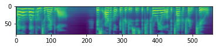

# Tacotron 2 Tutorial
[NVIDIA implementation version](https://pytorch.org/hub/nvidia_deeplearningexamples_tacotron2/)

NVIDIA 가 Tacotron 2를 Pytorch 로 구현하고 공개한 Tacotron 2 사용 방법을 정리한 자료입니다.
NVIDIA 는 Vocoder 로 WaveGlow 를 사용했습니다.
torch hub 에 Pretrained Model이 있어 간편하게 사용할 수 있습니다.


```python
import warnings
warnings.filterwarnings(action='ignore') 

import torch
device = 'cuda' if torch.cuda.is_available() else 'cpu'
```

### Tacotron 2 와 Vocoder 모델인 WaveGlow 모델을 불러오겠습니다


```python
# Load Tacotron 2 Model
tacotron2 = torch.hub.load('NVIDIA/DeepLearningExamples:torchhub', 'nvidia_tacotron2', model_math='fp16')
tacotron2 = tacotron2.to(device)
tacotron2.eval()

# Load WaveGlow model
waveglow = torch.hub.load('NVIDIA/DeepLearningExamples:torchhub', 'nvidia_waveglow', model_math='fp16')
waveglow = waveglow.remove_weightnorm(waveglow)
waveglow = waveglow.to(device)
waveglow.eval()

print("Model Loaded")
```

    Using cache found in /home/taesoo/.cache/torch/hub/NVIDIA_DeepLearningExamples_torchhub
    Using cache found in /home/taesoo/.cache/torch/hub/NVIDIA_DeepLearningExamples_torchhub


    Model Loaded


이제 Tacotron 2 를 통해서 문장을 생성할 준비가 끝났습니다.
그럼 "Hello, Welcome to my blog." 란 문장을 생성하고 들어보도록 하겠습니다.


```python
# Set Text to say
text = "Hello, Welcome to my blog. This article introduces the tutorial of the Tacotron 2"

# Preprocess, Convert the text into tokens, and get length of the tokens
utils = torch.hub.load('NVIDIA/DeepLearningExamples:torchhub', 'nvidia_tts_utils')
sequences, lengths = utils.prepare_input_sequence([text])

# Inference
with torch.no_grad():
    # 1. Generate mel-spectrogram for the text
    mel, _, _ = tacotron2.infer(sequences, lengths)

    # 2. Convert the mel-spectrogram into the wav
    audio = waveglow.infer(mel)
```

    Using cache found in /home/taesoo/.cache/torch/hub/NVIDIA_DeepLearningExamples_torchhub


위의 코드에서
~~~Python
utils = torch.hub.load('NVIDIA/DeepLearningExamples:torchhub', 'nvidia_tts_utils')
sequences, lengths = utils.prepare_input_sequence([text])
~~~
DNN 모델은 Text 데이터를 바로 입력으로 사용할 수 없습니다. 따라서, 각 글자 혹은 단어를 Tokenization 이란 과정을 거치면서 숫자로 표현해줍니다. 위의 코드가 이 과정을 수행하는 부분입니다. 자세한 내용은 추후에 기회가 되면 포스팅하도록 하겠습니다.

그리고,
~~~Python
# Inference
with torch.no_grad():
    # 1. Generate mel-spectrogram for the text
    mel, _, _ = tacotron2.infer(sequences, lengths)

    # 2. Convert the mel-spectrogram into the wav
    audio = waveglow.infer(mel)
~~~
위의 부분은 Tacotron 2 와 Waveglow 를 통해서 오디오를 생성하는 부분입니다. 2단계를 거치게 되는데, 먼저 Tacotron 2 로 Mel-Spectrogram 을 생성합니다. 그리고 생성된 Mel-spectrogram 을 WaveGlow의 입력으로 활용해 Raw Waveform 데이터를 최종적으로 생성합니다.

이제 직접 들어보도록 하겠습니다.

```python
audio_numpy = audio[0].data.cpu().numpy()
rate = 22050

# Save the time-domain waveform into .wav file
from scipy.io.wavfile import write
write("./audio.wav", rate, audio_numpy)

# Play the generated audio
from IPython.display import Audio
Audio(audio_numpy, rate=rate)
```

<audio controls="controls">
    <source type="audio/wav" src="../../../assets/Posts/Pretrained_NVIDIA/audio.wav"></source>
</audio>

매우 자연스러운 음성이 생성된 것을 확인할 수 있습니다. 하지만 마지막에 'Tacotron' 이란 단어는 잘 들리지 않네요. 이 부분은 논문에서도 나와 있듯이 고유 명사라 잘 생성하지 못하는 것 같습니다.
그럼 생성된 데이터와 Tacotron 2의 추론 과정을 조금 더 살펴보겠습니다


```python
import matplotlib.pyplot as plt
mel_spec = mel[0].detach().cpu().numpy()
print(f'shape of the mel {mel.shape}')
plt.imshow(mel_spec)
plt.show()
```

    Matplotlib created a temporary config/cache directory at /tmp/matplotlib-ueyn1i5e because the default path (/home/taesoo/.config/matplotlib) is not a writable directory; it is highly recommended to set the MPLCONFIGDIR environment variable to a writable directory, in particular to speed up the import of Matplotlib and to better support multiprocessing.


    shape of the mel torch.Size([1, 80, 557])


    


```python
with torch.no_grad():
    for i in range(3):
        mel, _, _ = tacotron2.infer(sequences, lengths)
        print(mel.shape)
```

    torch.Size([1, 80, 497])
    torch.Size([1, 80, 533])
    torch.Size([1, 80, 538])


위의 그림은 Mel-Spectrogram 을 시각화한 그림입니다.
80 mels 를 가진 Mel-Spectrogram 을 생성하는 것을 확인할 수 있습니다.
하지만 시간축의 경우, 같은 문장을 입력으로 넣더라고 매번 다른 길이로 생성하는 것을 알 수 있습니다.
이것은 논문에도 나와 있듯이 고정된 길이가 아닌 동적으로 생성하게 끔 모델을 만들었다고 하는 데, 이 특성이 잘 반영된 거 같습니다.
하지만, 고정된 모델 가중치인데, 어떤 변수로 매번 다른 값을 나타내는 지는 추후에 직접 구현해보면서 알아보도록 하겠습니다.

~~~ 오디오 파일이 업로드가 안되네요 ㅠㅠ ~~~

## References
Code : [NVIDIA implementation version](https://pytorch.org/hub/nvidia_deeplearningexamples_tacotron2/)